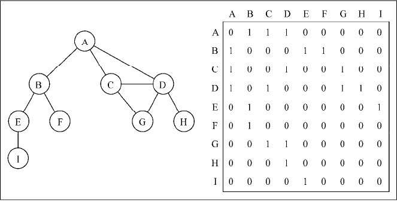
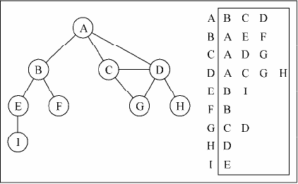
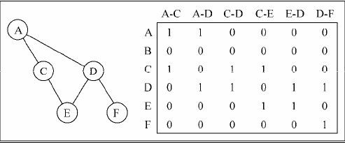
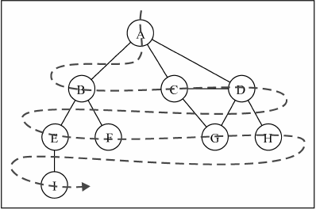
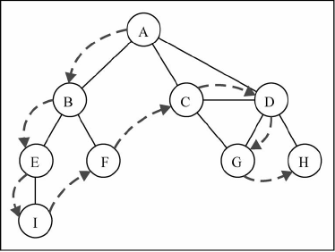
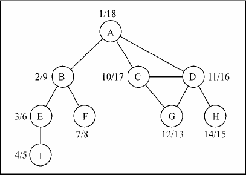
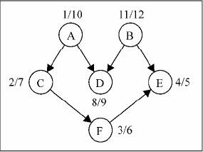

# Graph
## 定义
G=(V,E)
## 概念
- 一个顶点的度：其相邻顶点的数量
- 路径：顶点v1,v2,…,vk的一个连续序列，其中vi和vi+1相邻
- 简单路径：不包含重复的顶点的路径
- 无环：图中不存在环，则称该图无环
- 有向/无向：边没有方向，为无向图；边有方向，为有向图
- 连通性：图中每两个顶点间都存在路径，则该图连通
- 强连通性：有向图中，图中每两个顶点间在双向上都存在路径
- 加权/未加权：边赋予了权值，为加权图；边没有权值，为无权图

## 图的表示
- 邻接矩阵


- 邻接表



- 关联矩阵



## 图的遍历

|算   法|  数据结构 | 描   述 |
|:---|:---|:----|
|广度优先搜索 | 队列 | 将顶点存入队列中，最先入队列的顶点先被探索|
|深度优先搜索 | 栈 | 将顶点存入栈中，顶点是沿着路径被探索的，存在新的相邻顶点就去访问| 

用三种颜色来标注已经访问过的顶点,反映它们的状态。 
- 白色：表示该顶点还没有被访问；
- 灰色：表示该顶点被访问过，但并未被探索过；
- 黑色：表示该顶点被访问过且被完全探索过。

### BFS
>从指定的第一个顶点开始遍历图，先访问其所有的相邻点，就像一次访问图的一层。即先宽度后深度地访问顶点。

>应用：寻找最短路径

步骤：
- (1) 创建一个队列Q。 
- (2) ~~将v标注为被发现的（灰色）~~，并将v入队列Q。 
- (3) 如果Q非空，则运行以下步骤： 
    - (a) 将u从Q中出队列； 
    - (b) 将标注u为被发现的（灰色）； 
    - (c) 将u所有未被访问过的邻点（白色）入队列,并将白色置为（灰色）； 
    - (d) 将u标注为已被探索的（黑色）。
    

```
 A B C D E F G H I 
```
>#### Some shortest path algorithm
>- Dijkstra’s算法解决了单源最短路径问题。
>- Bellman–Ford算法解决了边权值为负的单源最短路径问题。
>- A*搜索算法解决了仅一对顶点间的最短路径问题，用经验法则来加速搜索过程。
>- Floyd–Warshall算法解决了所有顶点对间的最短路径这一问题。
 
### DFS
>从第一个指定的顶点开始遍历图，沿路径直到这条路径最后一个顶点被访问，接着原路回退并探索下一条路径。即先深度后广度地访问顶点。

> 应用：拓扑排序

要访问顶点v，有如下步骤： 
- (1) 标注v为被发现的（灰色）。 
- (2) 对于v的所有未访问的邻点w： 
    - (a) 访问顶点w。 
- (3) 标注v为已被探索的（黑色）。


```
//从栈顶依次出栈
|栈顶---------栈底|
A B E I F C D G H
```
下图展示了详细的遍历过程(discover/explored):



####　topological sorting


```
B A D C F E (答案不唯一，这只是一个可行解，取决于算法实现）
```