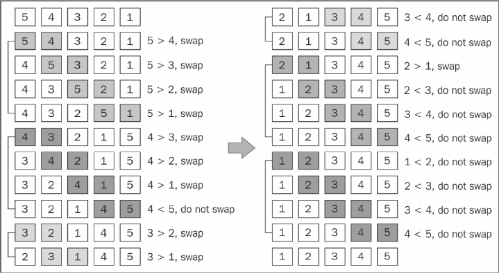

# bubbleSort
### 排序过程


### 关键代码
``` js
    this.bubbleSort = function () {
        var length = array.length;

        for (var i = 0; i < length; i++) {
            for (var j = 0; j < length - 1; j++) {
                if (array[j] > array[j + 1]) {
                    swap(j, j + 1);
                }
            }
        }
    };
```
### 时间复杂度
- 平均
- 最好
- 最坏

### 空间复杂度
O(1)

### 稳定性
稳定

