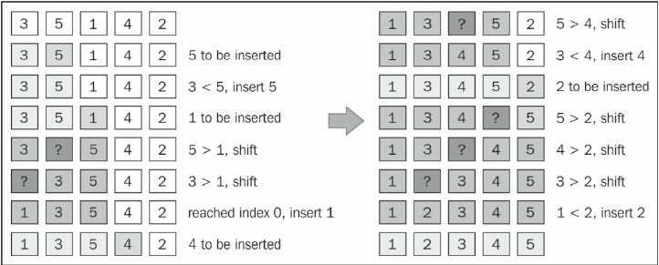

# insertionSort
### 排序过程


### 关键代码
``` js
    this.insertionSort = function () {
        var length = array.length,
            j, temp;
        for (var i = 1; i < length; i++) {
            j = i;
            temp = array[i];
            console.log('to be inserted ' + temp);
            while (j > 0 && array[j - 1] > temp) {
                console.log('shift ' + array[j - 1]);
                array[j] = array[j - 1];
                j--;
            }
            console.log('insert ' + temp);
            array[j] = temp;
        }
    };
```
### 时间复杂度
- 平均
- 最好
- 最坏

### 空间复杂度
O()

### 稳定性
 
