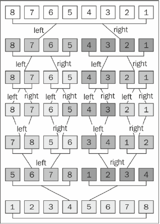

# mergeSort
>分治算法(递归实现)：将原数组切分成较小数组，直到每个小数组有序(一个数)，接着将小数组归并成较大数组，最后只有一个排序完毕的大数组。
### 排序过程


### 关键代码
``` js
    this.mergeSort = function () {
        array = mergeSortRec(array);
    };
    
    //递归地将大数组拆分为小数组，并调用归并函数merge
    var mergeSortRec = function (array) {
        var length = array.length;

        if (length === 1) {
            console.log(array);
            return array;
        }

        var mid = Math.floor(length / 2),
            left = array.slice(0, mid),
            right = array.slice(mid, length);

        return merge(mergeSortRec(left), mergeSortRec(right));
    };

    //归并小数组为大数组，同时排序
    var merge = function (left, right) {
        var result = [],
            il = 0,
            ir = 0;

        while (il < left.length && ir < right.length) {
            if (left[il] < right[ir]) {
                result.push(left[il++]);
            } else {
                result.push(right[ir++]);
            }
        }

        while (il < left.length) {
            result.push(left[il++]);
        }

        while (ir < right.length) {
            result.push(right[ir++]);
        }

        return result;
    };
```
### 时间复杂度
- 平均
- 最好
- 最坏

### 空间复杂度
O()

### 稳定性