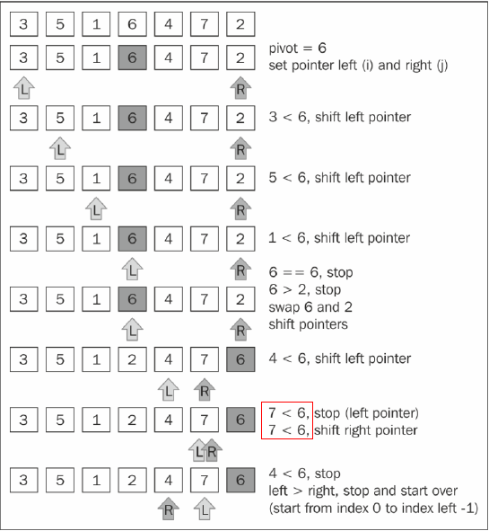
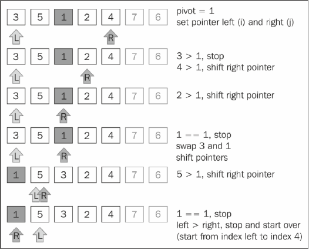
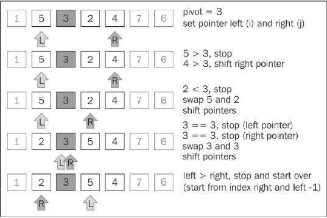
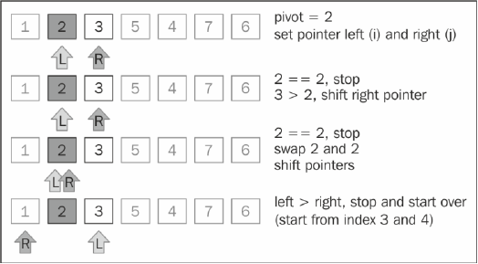
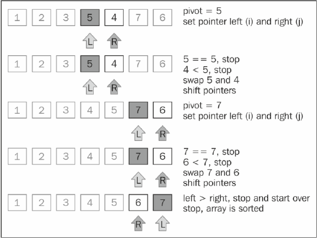

# quickSort
- (1)首先，从数组中选择中间一项作为主元。 
- (2)创建两个指针，左边一个指向数组第一个项，右边一个指向数组最后一个项。移动左指
针直到我们找到一个比主元大的元素，接着，移动右指针直到找到一个比主元小的元素，然后交
换它们，重复这个过程，直到左指针超过了右指针。这个过程将使得比主元小的值都排在主元之
前，而比主元大的值都排在主元之后。这一步叫作划分操作。 
- (3)接着，算法对划分后的小数组（较主元小的值组成的子数组，以及较主元大的值组成的
子数组）重复之前的两个步骤，直至数组已完全排序

### 排序过程






### 关键代码
``` js
    this.quickSort = function () {
        quick(array, 0, array.length - 1);
    };
    
    var quick = function (array, left, right) {
        var index;

        if (array.length > 1) {

            index = partition(array, left, right);

            if (left < index - 1) {
                quick(array, left, index - 1);
            }

            if (index < right) {
                quick(array, index, right);
            }
        }
        return array;
    };
    
    var partition = function (array, left, right) {
    
        var pivot = array[Math.floor((right + left) / 2)],
            i = left,
            j = right;

        console.log('pivot is ' + pivot + '; left is ' + left + '; right is ' + right);

        while (i <= j) {
            while (array[i] < pivot) {
                i++;
                console.log('i = ' + i);
            }

            while (array[j] > pivot) {
                j--;
                console.log('j = ' + j);
            }

            if (i <= j) {
                console.log('swap ' + array[i] + ' with ' + array[j]);
                swapQuickStort(array, i, j);
                i++;
                j--;
            }
        }
        
        return i;
    };
```
### 时间复杂度
- 平均
- 最好
- 最坏

### 空间复杂度
O()

### 稳定性
