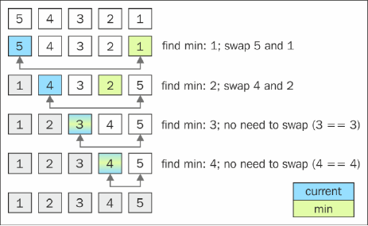

# selectionSort
### 排序过程


### 关键代码
``` js
    this.selectionSort = function () {
        var length = array.length,
            indexMin;

        for (var i = 0; i < length - 1; i++) {
            indexMin = i;
            for (var j = i; j < length; j++) {//TODO:j=i+1 is better?
                if (array[indexMin] > array[j]) {
                    indexMin = j;
                }
            }
            if (i !== indexMin) {
                swap(i, indexMin);
            }
        }
    };
```
### 时间复杂度
- 平均
- 最好
- 最坏

### 空间复杂度
O()

### 稳定性
