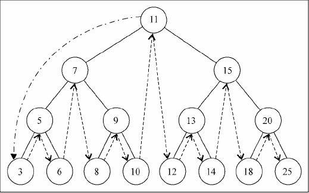
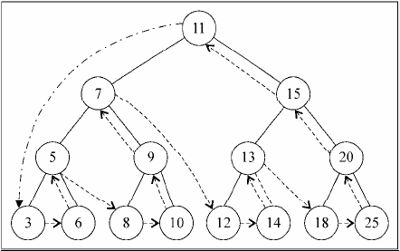
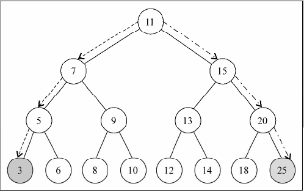

# Tree

## preOrderTraverse


- 前序遍历可以打印一个结构化的文档
```
11 7 5 3 6 9 8 10 15 13 12 14 20 18 25
```

## inOrderTraverse


- 中序遍历BST可以得到一个有序序列
```
3 5 6 7 8 9 10 11 12 13 14 15 18 20 25
```

## postOrderTraverse


- 后序遍历可以用来计算一个目录和它的子目录中所有文件所占空间的大小
```
3 6 5 8 10 9 7 12 14 13 18 25 20 15 11
```

## minAndMaxValue


```
//minValue is 3
11 -> 7 -> 5 -> 3 

//maxValue is 25
11 -> 15 -> 20 -> 25
```